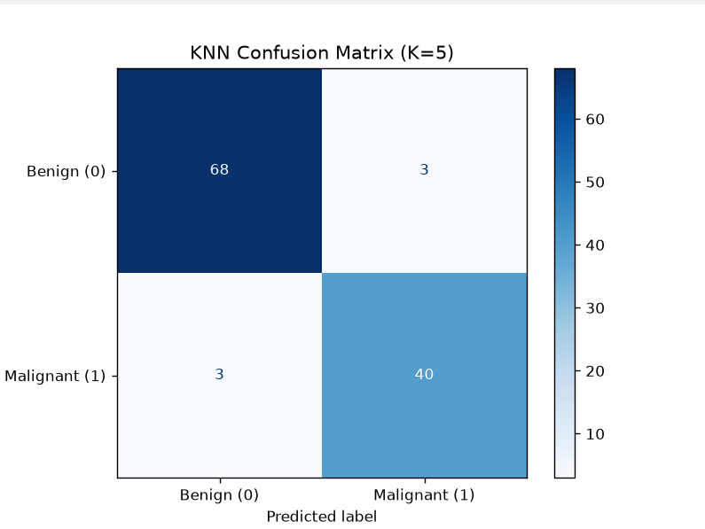

# Breast Cancer Classification using K-Nearest Neighbors (KNN)

## Objective
To build a K-Nearest Neighbors (KNN) classification model that predicts
whether a breast tumor is Malignant (M) or Benign (B) based on diagnostic
measurements.

## Dataset Link
[Position Salaries Dataset — Kaggle](https://www.kaggle.com/datasets/uciml/breast-cancer-wisconsin-data)

The dataset (`breast_cancer.csv`) is included in this repository for
convenience, and is also available at the Kaggle link above.

## Libraries Used
- pandas
- numpy
- scikit-learn
- matplotlib

## Methodology
1. **Data Understanding**: Loaded the dataset, inspected the first five
   records, identified 30 numerical diagnostic features and `diagnosis`
   as the target variable, and reviewed dataset info and summary
   statistics.
2. **Data Preprocessing**:
   - Checked for missing values (none found).
   - Removed the `id` column since it is only a row identifier.
   - Encoded the target variable (`B` = Benign → 0, `M` = Malignant → 1).
   - Split the data into 80% training and 20% testing sets (stratified on
     the target).
   - Standardized all features with `StandardScaler`, which is essential
     for KNN since it is a distance-based algorithm.
3. **Model Development**: Trained a `KNeighborsClassifier` with K = 5 and
   predicted class labels for the test set.
4. **Model Evaluation**: Evaluated the model on the test set using
   Accuracy, Precision, Recall, and F1-Score, and generated a confusion
   matrix.

## Results
| Metric    | Value |
|-----------|-------|
| Accuracy  | ≈ 0.9561 |
| Precision | ≈ 0.9744 |
| Recall    | ≈ 0.9048 |
| F1-Score  | ≈ 0.9383 |

The model separates malignant and benign tumors very well once features
are standardized; the small number of errors made are more often missed
malignant cases (false negatives) than false alarms.



## Conclusion
This project built a K-Nearest Neighbors (K=5) classifier to distinguish
malignant from benign breast tumors using diagnostic measurements,
achieving an accuracy of 0.96, precision of 0.97, recall of 0.90, and
F1-score of 0.94 on the test set. Feature scaling was essential here,
since KNN classifies points based on distance to their nearest neighbors,
and unscaled features measured on very different ranges (such as area
versus smoothness) would let larger-magnitude features dominate the
distance calculation and distort predictions. After standardizing all
features, the model separated malignant and benign cases with high
accuracy, confirming that these diagnostic measurements are strong
discriminators of tumor type. A key limitation of KNN is that it is
computationally expensive at prediction time, since it must compute
distances to all training points for every new prediction, making it
slow to scale to very large datasets compared to models that learn a
fixed set of parameters upfront.

## How to Run
```bash
pip install pandas numpy scikit-learn matplotlib
python Assignment-4.py
```
or open `Assignment-4.ipynb` in Jupyter and run all cells.